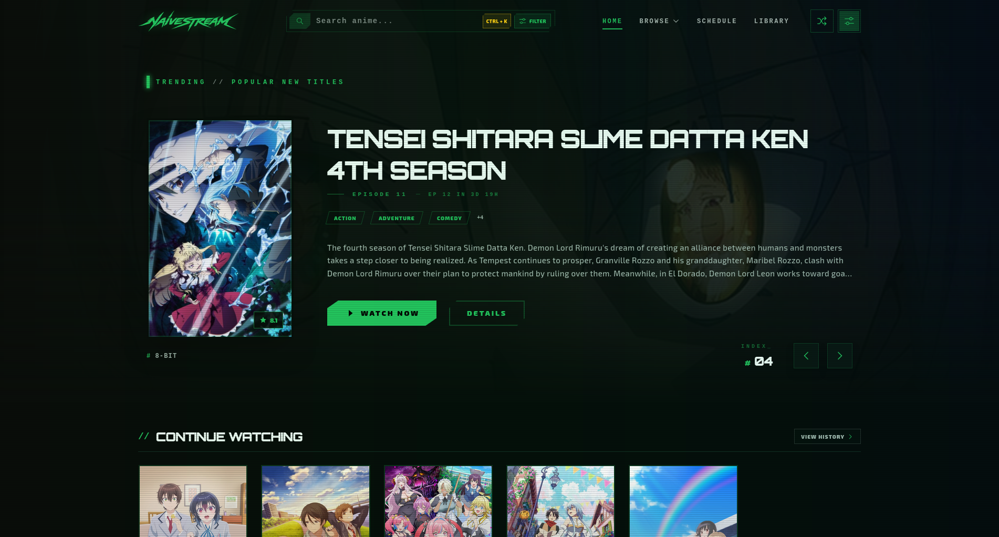
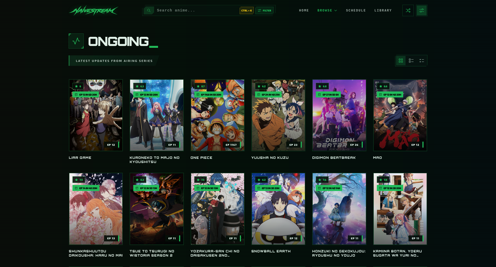
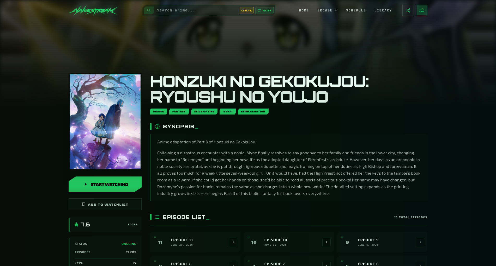
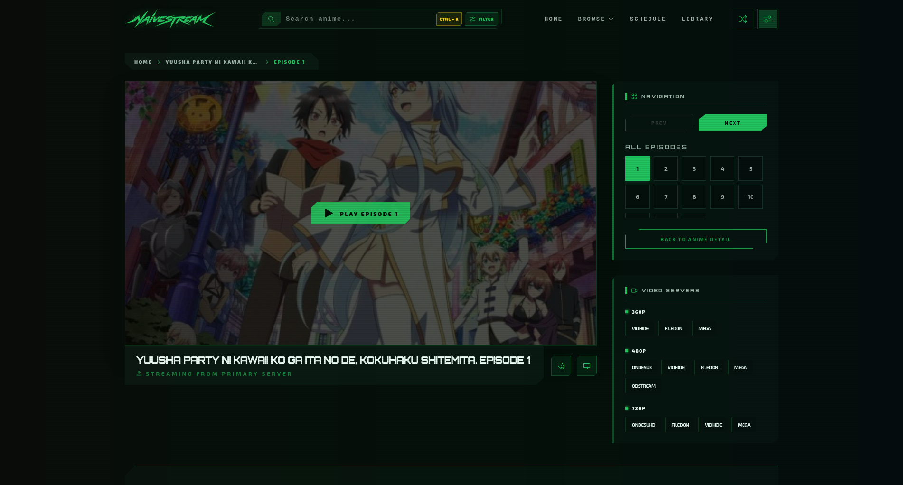

<div align="center">


</br>

[](https://naivestream.vercel.app)

</br>

[](https://github.com/na-ive/naivestream/stargazers)
[](https://github.com/na-ive/naivestream/commits/main)
[](https://github.com/na-ive/naivestream)
[](LICENSE)
[](https://tako.id/naive)

</div>


## Key Features

- **Hero Carousel:** Auto-rotating spotlight of trending ongoing anime with airing schedules.
- **Smart Sections:** Homepage sections for ongoing, completed, and daily schedule (intelligently sorted).
- **Advanced Search:** Full-text search with filters for status, type, genre, season, year, studio, rating, and more.
- **A-Z Listing:** Alphabetical browse with letter pagination.
- **Anime Detail Pages:** Synopsis, genres, characters & voice actors, episode list, and similar recommendations.
- **Video Player:** Integrated episode watching with multiple server source switching.
- **Continue Watching:** Pick up where you left off. Progress saved locally in your browser.
- **Library:** Local watchlist and watch history management (no account required).
- **Operator Panel:** Secure admin dashboard with server metrics, system logs, and database statistics.
- **Dark Theme:** Cyberpunk-inspired visual design with subtle neon accents.
- **Responsive:** Fully adaptive layout for desktop, tablet, and mobile.

## Tech Stack

| Layer | Technology |
| :--- | :--- |
| **Framework** | Next.js 16 (App Router) |
| **UI Library** | React 19 |
| **Styling** | Tailwind CSS 4 |
| **Typography** | Exo 2 + Orbitron |
| **Database** | SQLite 3 via `better-sqlite3` |
| **Animations** | Framer Motion |
| **Icons** | Carbon Icons |
| **Player** | Embedded iframe from external sources |

## Database Schema

<details>
<summary>Click to expand: SQLite schema (9 tables)</summary>

```sql
-- Core anime metadata
CREATE TABLE IF NOT EXISTS anime (
    id                INTEGER PRIMARY KEY AUTOINCREMENT,
    slug              TEXT UNIQUE NOT NULL,
    mal_id            INTEGER,
    title             TEXT NOT NULL,
    title_english     TEXT,
    title_japanese    TEXT,
    title_synonyms    TEXT,
    type              TEXT,
    status            TEXT,
    season            TEXT,
    year              INTEGER,
    score             REAL DEFAULT 0.0,
    scored_by         INTEGER DEFAULT 0,
    members           INTEGER DEFAULT 0,
    popularity        INTEGER,
    rank              INTEGER,
    synopsis          TEXT,
    poster            TEXT,
    duration_minutes  INTEGER,
    episodes_count    INTEGER,
    aired             TEXT,
    producers         TEXT,
    studios           TEXT,
    rating            TEXT,
    source            TEXT,
    release_day       TEXT,
    youtube_trailer_id TEXT,
    anilist_id        INTEGER,
    banner            TEXT,
    next_episode      INTEGER,
    next_airing_at    INTEGER,
    is_fully_scraped  INTEGER DEFAULT 0,
    is_protected      INTEGER DEFAULT 0,
    last_updated      DATETIME DEFAULT CURRENT_TIMESTAMP
);

-- Episodes linked to each anime
CREATE TABLE IF NOT EXISTS episodes (
    id                INTEGER PRIMARY KEY AUTOINCREMENT,
    anime_id          INTEGER,
    slug              TEXT UNIQUE NOT NULL,
    title             TEXT NOT NULL,
    eps_number        REAL,
    uploaded_at       TEXT,
    FOREIGN KEY (anime_id) REFERENCES anime(id) ON DELETE CASCADE
);

-- Genres (normalized)
CREATE TABLE IF NOT EXISTS genres (
    id                INTEGER PRIMARY KEY AUTOINCREMENT,
    name              TEXT UNIQUE NOT NULL,
    slug              TEXT UNIQUE NOT NULL
);

CREATE TABLE IF NOT EXISTS anime_genres (
    anime_id          INTEGER NOT NULL,
    genre_id          INTEGER NOT NULL,
    PRIMARY KEY (anime_id, genre_id),
    FOREIGN KEY (anime_id) REFERENCES anime(id) ON DELETE CASCADE,
    FOREIGN KEY (genre_id) REFERENCES genres(id) ON DELETE CASCADE
);

-- Characters & Voice Actors
CREATE TABLE IF NOT EXISTS characters (
    id                INTEGER PRIMARY KEY AUTOINCREMENT,
    anilist_id        INTEGER UNIQUE,
    name              TEXT NOT NULL,
    image             TEXT
);

CREATE TABLE IF NOT EXISTS anime_characters (
    anime_id          INTEGER NOT NULL,
    character_id      INTEGER NOT NULL,
    role              TEXT,
    PRIMARY KEY (anime_id, character_id),
    FOREIGN KEY (anime_id) REFERENCES anime(id) ON DELETE CASCADE,
    FOREIGN KEY (character_id) REFERENCES characters(id) ON DELETE CASCADE
);

CREATE TABLE IF NOT EXISTS voice_actors (
    id                INTEGER PRIMARY KEY AUTOINCREMENT,
    anilist_id        INTEGER UNIQUE,
    name              TEXT NOT NULL,
    image             TEXT,
    language          TEXT
);

CREATE TABLE IF NOT EXISTS character_voice_actors (
    anime_id          INTEGER NOT NULL,
    character_id      INTEGER NOT NULL,
    voice_actor_id    INTEGER NOT NULL,
    PRIMARY KEY (anime_id, character_id, voice_actor_id),
    FOREIGN KEY (anime_id) REFERENCES anime(id) ON DELETE CASCADE,
    FOREIGN KEY (character_id) REFERENCES characters(id) ON DELETE CASCADE,
    FOREIGN KEY (voice_actor_id) REFERENCES voice_actors(id) ON DELETE CASCADE
);

-- Stream link cache
CREATE TABLE IF NOT EXISTS stream_cache (
    id                INTEGER PRIMARY KEY AUTOINCREMENT,
    episode_slug      TEXT NOT NULL,
    quality           TEXT,
    server_name       TEXT,
    iframe_url        TEXT,
    created_at        DATETIME DEFAULT CURRENT_TIMESTAMP
);
```
</details>
 
## Getting Started

### Prerequisites

- **Node.js** >= 20
- **npm** or any compatible package manager

### Installation

```bash
git clone https://github.com/your-username/naivestream.git
cd naivestream
npm install
```

**Note:** This demo version comes pre-configured with `example-anime.db` which contains a sample of 100 anime. It does not include the automated scraper (`backend/` folder). You do not need to provide your own database to run the demo.

### Development

```bash
npm run dev
```

Open [http://localhost:3000](http://localhost:3000) in your browser.

### Production Build

```bash
npm run build
npm start
```

## Environment Variables

Create a `.env` file in the project root with the following variables:

| Variable | Default | Description |
| :--- | :--- | :--- |
| `DATABASE_PATH` | *(Auto-resolves)* | Path to SQLite DB. Automatically falls back to `example-anime.db` in the demo. |
| `AUTH_SECRET` | *(Required)* | 32-byte base64 string for session encryption. Generate with: <br/>`node -e "console.log(require('crypto').randomBytes(32).toString('base64'))"` |
| `ADMIN_USERNAME` | `admin` | Username for the Operator Panel. |
| `ADMIN_PASSWORD` | *(Required)* | bcrypt hash of your password. Generate with: <br/>`node -e "console.log(require('bcrypt').hashSync('YourPassword', 12).replaceAll('$', '\\\\$'))"` |

## Screenshots

| Homepage | Ongoing |
| :---: | :---: |
|  |  |

| Anime Detail | Watch |
| :---: | :---: |
|  |  |

## Credits

- **Content & Streaming:** Custom automated scraper (with fallback/legacy support via [Sanka API](https://github.com/SankaVollereii))
- **Metadata:** AniList & MyAnimeList
- **Icons:** [Carbon Icons](https://carbondesignsystem.com/guidelines/icons/library/)
- **Fonts:** Exo 2 & Orbitron via Google Fonts

## License

[MIT](LICENSE)
